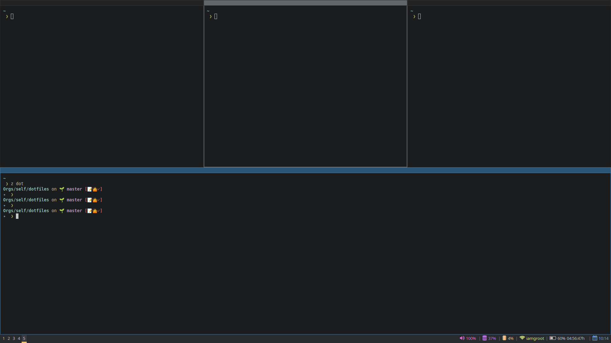

# dotfiles

My ~/.* curated with :heartpulse: with the help from several awesome Open Source repos, Reddit and Stack Overflow.

Often requires :fire_engine: and :hammer:.

## i3wm setup

There's a basic i3wm setup that looks pretty and clean.
Modifications apart from generic configuration include polybar, rofi and alacritty.

It currently looks like the following.

